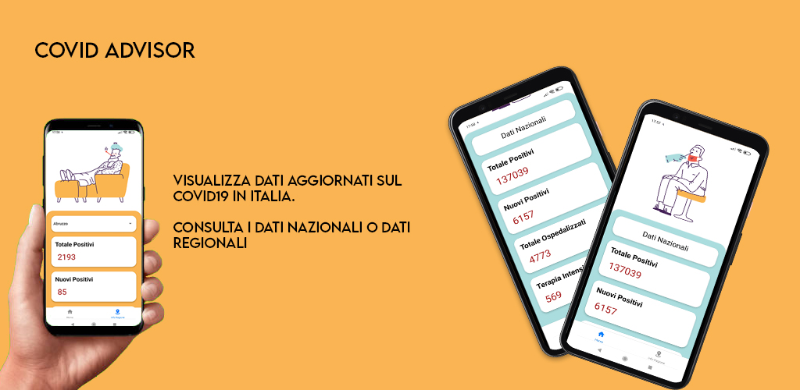

# Covid Advisor 
> Semplice app che mostra le informazioni principali relative al Covid19 in Italia.

Questa app ti permette di visualizzare dati aggiornati sul Covid19 in Italia.

Tramite la ricerca per regione potrai informarti di più su di una regione nello specifico.

## Meta

Niccolò Lucozzi – [@Nik_Lucoz](https://www.instagram.com/nik_lucoz/) – lucozzi.lavoro@gmail.com

Distributed under the MIT license. See ``LICENSE`` for more information.

## Contribuisci

1. Forka la repository (<https://github.com/yourname/yourproject/fork>)
2. Crea il Brach per la tua feature (`git checkout -b feature/fooBar`)
3. esegui un Commit (`git commit -am 'Add some fooBar'`)
4. Esegui una Push (`git push origin feature/fooBar`)
5. Crea una nuova Pull Request

